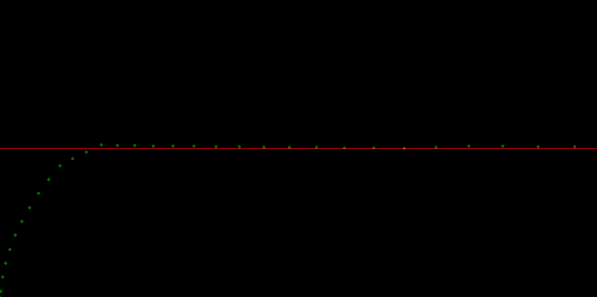

## SudoAir
Goal: Desining controller(s) in C++ for the CrazyFlie mini drone and additional computer vision based modules to allow the drone to navigate in total autonomy in complex environment.  

#### Current PID response on z-axis
  

#### State Arrays  
- xyz_state: `x, y, z, x_dot, y_dot, z_dot, x_ddot, y_ddot, z_ddot`
- xyz_state_des: Same for desired states
- angle_state_wf: `phi, theta, psi, phi_dot, theta_dot, psi_dot, phi_ddot, theta_ddot, psi_ddot - (World frame)`
- angle_state_wf_des: `Same for desired/cmd state angles - (World frame)`
